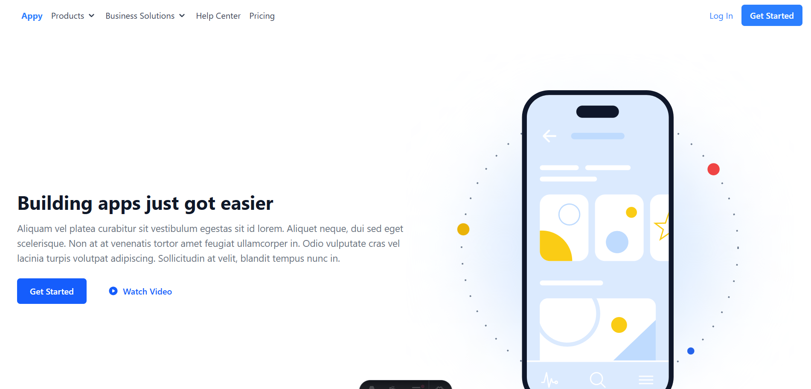
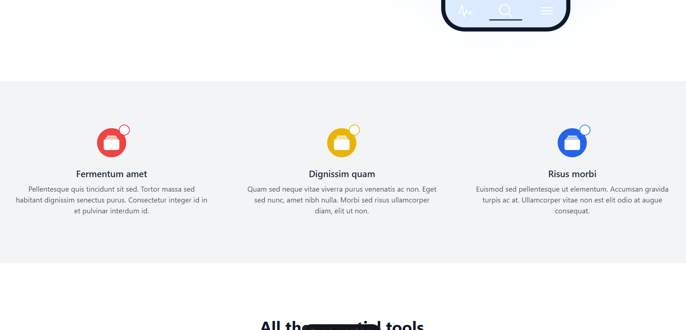
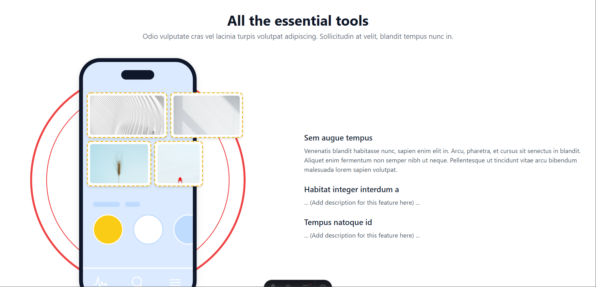
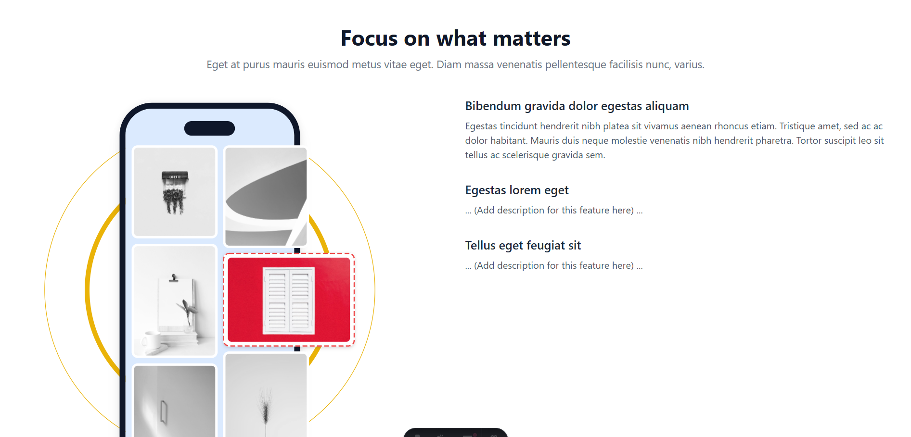
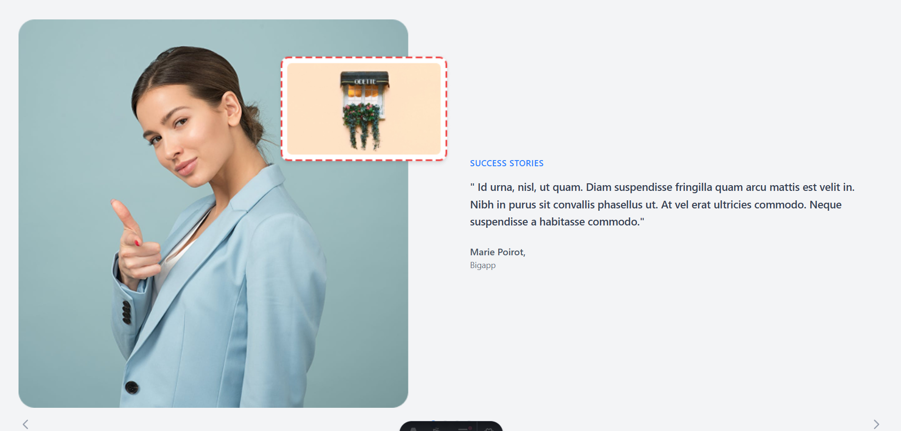
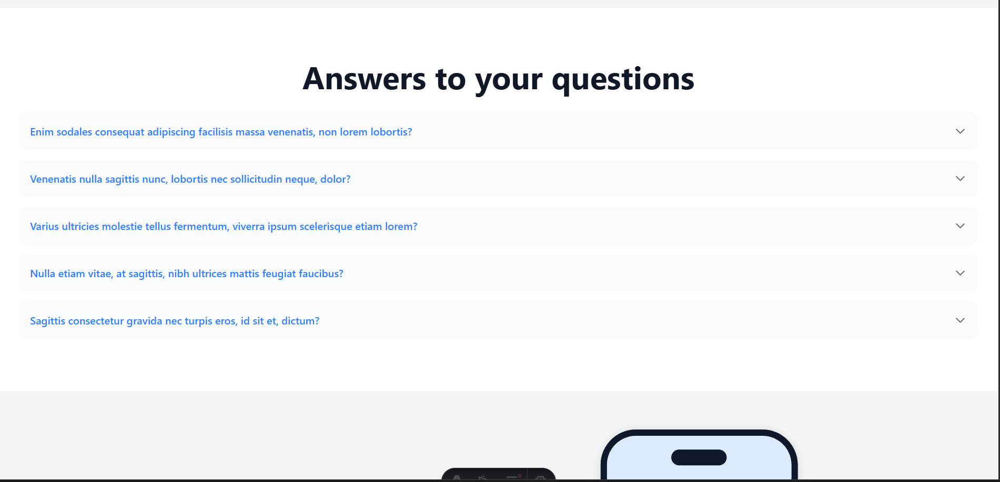
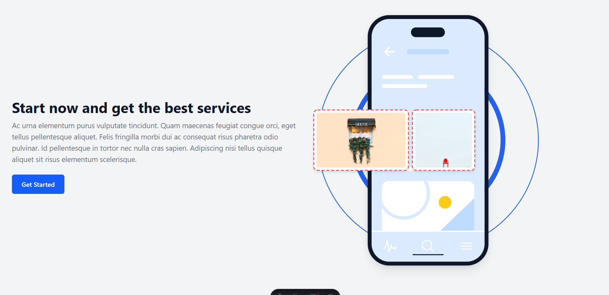

# Page APPY with Astro

## Figma
>[!NOTE]
> # Figma design https://www.figma.com/design/5NmcUDyedMw2QDuvPECbhU/Landing-Page-Kit---Free-13-Landing-Pages-Collection-for-UI-UX-Design--Community-?node-id=30-7001&t=EfylCb1DsLLvDDFV-0

## RUN PROYECT
> [!NOTE] 
> # First run nmp install to download the dependencies and to run the project use npm run dev

| capture 1 | capture 2 |  
| -------- | -------- |
|  |  |
| capture 3 | capture 4 |  
| -------- | -------- |
|  |  |

| capture 5 | capture 6 |  
| -------- | -------- |
|  |  |

| capture 7 
| -------- 
| 

